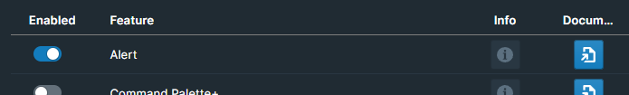
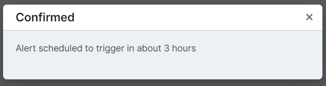

# Overview

WorkBench Alerts allows users to schedule alerts within their graphs

# How to Use

Toggle the Alert feature on inside WorkBench.

## Create Alert

Create an alert by opening the Roam Command Palette and entering `Create New Alert`.

A popover will appear with `When` and `Message` fields.

**When**

Enter when you want the alert to trigger in natural language like "In 5 minutes" or "In 2 hours" in the `When` field.

**Message**

Enter what message you want the alert to say in the `Message` field.

## Confirmation

A confirmation modal will appear, scheduling the alert on confirmation. After the specified amount of time, an alert will appear in Roam with the message you specified!

## Allow Notifications

Additionally, the dialog has an `Allow Notification` checkbox. When checked, the alert will instead use a browser notification for the alert instead of a Roam UI alert. You will need to enable browser notifications from Roam to use this.

## View Alerts

At any time, you could open the Roam Command Palette and entering `View Current Alerts` to view the Alerts Dashboard. Here, you'll see a list of all of your live alerts. Clicking the trash icon will remove the alert.

<!-- # Custom Styling -->
<!-- BUG: 
 doesn't wrap -->
<!-- The Alert used is Blueprint's [Alert component](https://blueprintjs.com/docs/#core/components/alert). Additionally, there is a `roamjs-window-alert` class name on the component to allow for custom styling in your Roam themes. -->

# Demo

https://github.com/RoamJS/workbench/assets/3792666/f92ed07f-2830-4d04-ba1d-e8158b3d4311
