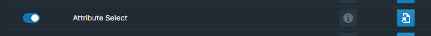

# Overview

The Attribute Select feature offers an intuitive way to interact with attributes in your Roam Research database. It provides a dropdown button next to each attribute in your database, allowing you to select from predefined options. This can be incredibly useful for attributes that have a limited set of possible values, like `Status`, `Priority`, or `Type`.

# How to Use

To get started with the Attribute Select feature, follow the steps below:

## Enable the Attribute Select Module

Toggle the Attribute Select module on inside WorkBench.

<!-- TODO -->

## Configure Attributes and Options

Navigate to the `roam/js/attribute-select` page in your Roam database. Here you'll find a configuration panel where you can define which attributes should show a dropdown, and what the options in each dropdown should be.

Each attribute has its own options panel where you can define, edit, or remove the available options. You can also find all existing values in your database for that attribute.

### Adding an Attribute

Click on the "Add An Attribute" button to add a new attribute. You can choose an attribute name from the existing attributes in your graph.

### Defining Options for an Attribute

Once an attribute is added, you'll see it appear in the left sidebar. Clicking on it will show you the options that are currently defined. You can manually edit these options right in the block, or use the `Find All Current Values` button to automatically scan your database for existing values of the attribute.

### Find All Current Values

The `Find All Current Values`` button scans your database for unique existing values for the attribute, and lists them so you can easily add them to the options.

### Remove an Attribute

If you no longer want a dropdown for a particular attribute, you can remove it by clicking the "Remove Attribute" button. This will also delete the corresponding configuration from the `roam/js/attribute-select` page.

## Interacting with Attributes in the Database

Once you've defined attributes and their options, you'll start seeing dropdown buttons next to the corresponding attributes in your database.

Clicking on the button will open a dropdown where you can select a value.

# Customization and Styling

You can customize the appearance of the dropdowns by targeting the following CSS classes:

- Dropdown button: `roamjs-attribute-select-button`
- Popover content: `roamjs-attribute-select-popover`

## Developer API

For developers of other extensions who want to interact with the Attribute Select feature, we expose the following API, available on the global `window.roamjs.extension.workbench` object:

- `refreshAttributeSelect` - `() => void` Refreshes the defined attributes and updates the attribute observer. This is useful when attributes or options have been programmatically updated and need to be reflected in the UI without a page reload.

<!-- # Demo -->

<!-- TODO -->
