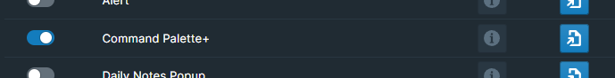

# **Overview of Command Palette Plus**

This feature adds an extensive set of user generated and prebuilt commands to help users push Roam to new places. Navigate and manipulate your Roam environment with a bunch of handy commands, all without losing context.

# **How to Use**

Toggle the Command Palette Plus module on inside WorkBench.

To trigger the native Roam Command Palette, simply trigger either `CMD+p` (Mac) or `CTRL+p` (Windows). An input dialog should appear on your screen, allowing you to start typing to search for the command you would like to perform.

Command Palette+ adds all of its commands to this palette with the prefix `(WB)`. They often will also have a shortcut at the end of the command label, for quicker access to specific commands. These commands are context aware: they are aware of where you triggered the command and how many blocks were previously selected. The list of commands that are added are detailed below:

It's possible to assign a unique hotkey to individual commands, should you prefer to do so. To accomplish this, navigate to either `Settings` > `Hotkeys` or the WorkBench Extension Settings.

## Working with Blocks

- Move Blocks - Moves the currently selected block or blocks to another location in your graph. Many combinations of moves exist:
  - Move to top or bottom of page.
  - Move to page, but then open it in sidebar or main window.
  - Move it and leave behind a block reference
  - Sending references to top or bottom
- Pull Blocks - Pull a block from another location in your graph into the current location.
  - Commands for pulling a block's children are also available.
- Pull References - Pull a page's references into the current page as block references
  - A remove option also available that removes the original reference from the source block.
- Jump to block - Jumps to another block in your graph. This opens the whole page but scrolls the block in view.
- Daily Notes Page - Move a block to a Daily Notes Page using Natural Language Processing for dates
- Copying block reference - with and without alias
- Sort Child Blocks

## Working with Sidebars

- Swap main window with right sidebar
- Remove and close all windows in right sidebar
- Open both sidebars
- Close both sidebars

## Working with Pages

- Open a block as a page in the main window or in the sidebar
- Delete the current page or page specified in the path navigator
  - To remove the confirmation modal, create a block somewhere in your graph with the text: `#42Setting workBenchDcpConfirm off`

## Working with Navigation

- Daily Notes - jump to the daily notes page
- All Pages - jump to the all pages page
- Graph Overview - jump to the graph overview page
- Go to next day
- Go to previous day

## Working with other WorkBench Modules

- Privacy Mode - Toggle Privacy Mode
- Converter - Show format converter
- Web View - Show Web View
- Help - Show Quick Reference
- Tutorials - Show Tutorials
- Stats - Show Stats

## Working with Formatting

- Heading - quickly change heading of selected blocks

## Working with Inboxes

You can define commonly used destination points for moving items to other locations in the graph, similar to an inbox. You can have multiple named inboxes as destinations in your graph, and you can define inboxes anywhere in your graph. The structure of an inbox looks like the following:

- #42workBench Inbox
  - Name:
  - Page:
  - Text:
  - Location:
  - Blockref:
  - Users:

Each child block parameter starts with the name of the parameter, followed by the value. The child block parameters are defined as follows:

- Name: Name that will appear in the command palette
- Page: (OPTIONAL) Page name for this inbox. Default is today's DNP
- Text: (OPTIONAL) finds block with Text on the page, and blocks are set to the children of this block. The first block to match the text will be used for this
- Location: (OPTIONAL) Defines if new blocks should be put at the top or bottom. Top is the default. Valid values include:
  - top
  - bottom
- Blockref: (OPTIONAL) leave a block ref when moving the selected blocks to the Inbox if true. Leave the block and send a block reference if reverse. Default is false. Valid values include:
  - true
  - false
  - reverse
- Users: (OPTIONAL) comma separated list of email address. This is the email address of the user for roam. If their email is in this list, they will see this Inbox action, otherwise note.

If newly defined inboxes are not appearing in the command palette, fire the "Refresh Inboxes" command from the command palette.
