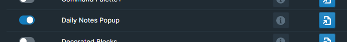

# Overview

Daily Note Popup is a second window that you can quickly toggle open and closed to get at your daily notes page or any other page. It is often referred to as the "Roam within your Roam."

# How to Use

Toggle the Daily Notes Popup module on inside WorkBench.

To toggle your daily note page popup, hit `ALT` + `SHIFT` + `,`. The popup that appears is editable, without needing to leave your current location.

You can drag the window by clicking on the top bar. Resize the window by clicking and dragging the borders.

To toggle focus between the main window and the Daily Note Popup window, simply hit `ALT` + `SHIFT` + `CTRL` + `,`.

It's possible to assign a unique hotkey to individual commands, should you prefer to do so. To accomplish this, navigate to either `Settings` > `Hotkeys` or the Workbench Extension Settings.

# Other DNP Utilities

There are a few other utilities related to daily note pages included in this module.

## Jump Date

The command `(WB) DNP Jump Date Forward` will move your daily note page will move forward a day.

Conversely, the command `(WB) DNP Jump Date Backward` will move your daily note page will move backward a day.

You can set hotkeys to both of these commands in `Settings` > `Hotkeys`

## Jump to Date Icon

If you hit the keyboard shortcut `ALT`+`SHIFT`+`J`, you will will jump to the native roam date picker and be able to pick a date to jump to using the keyboard navigation.

## Daily Note Subtitles

The Daily Note Popup module will insert subtitles to each of the daily note pages showing what day of the week it is:

To toggle this feature off, create a block somewhere in your graph with the text: `#42Setting dailySubtitles off` and refresh Roam.

## Demo Video

The video below is a bit outdated, but is the closest to resembling what the Daily Note Popup does:

[Video](https://youtu.be/wbNMKa232MM)
