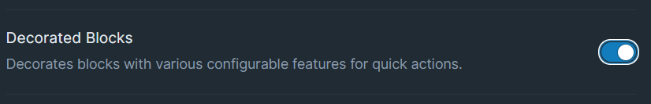
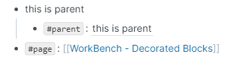

# Overview

WorkBench's decorated blocks displays various configurable features around blocks for quick actions.

# How to Use

Toggle the Decorated Blocks module on inside WorkBench.

Once enabled, a command will become enabled, `Toggle Block Decorators`. This will open a dialog allowing the user to specify which type of block decorations they would like to their graph.

It's possible to assign a unique hotkey to this command, should you prefer to do so. To accomplish this, navigate to either `Settings` > `Hotkeys` or the WorkBench Extension Settings.

The following decorations are supported:

## Move Todos Enabled

On a Daily Notes Page, When you hover over a block that contains a `TODO`, a right facing triangle will appear to the right.

Clicking this button will will bring up a date time popover, giving users the option to move the block to a future date.

## Move Tags Enabled

On a Daily Notes Page, When you hover over a tag (eg. `#someTag` or `[[someTag]]`), a right facing triangle will appear to the right.

Clicking this button will will bring up a date time popover, giving users the option to move the block to a future date.

## Context Enabled

Enabling this will

- replace a `#parent` tag with a rendering of the parent block
- a `#page` tag with a rendering of the block's page name.

## Hex Color Preview Enabled

Tags that are 6 alpha numeric characters will display the color the tag represents. (eg. `#880808`)
