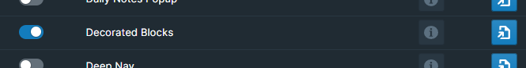

# Overview

WorkBench's decorated blocks displays various configurable features around blocks for quick actions.

# How to Use

Toggle the Decorated Blocks module on inside WorkBench.

Once enabled, a command will become enabled, `Toggle Block Decorators`. This will open a dialog allowing the user to specify which type of block decorations they would like to their graph. The following are supported:

Move Todos Enabled - a right facing triangle will appear next to blocks that have TODOs. Clicking this button will will bring up a date time popover, giving users the option to move the block to a future date.

Move Tags Enabled - a right facing triangle will appear next to blocks that have a tag. Clicking this button will will bring up a date time popover, giving users the option to move the block to a future date.

Context Enabled - Replace the `parent` tag with a rendering of the parent block and the `page` tag with a rendering of the block's page name.

Hex Color Preview Enabled - Tags that are 6 alpha numeric characters will display the color the tag represents.

It's possible to assign a unique hotkey to this command, should you prefer to do so. To accomplish this, navigate to either `Settings` > `Hotkeys` or the WorkBench Extension Settings.
