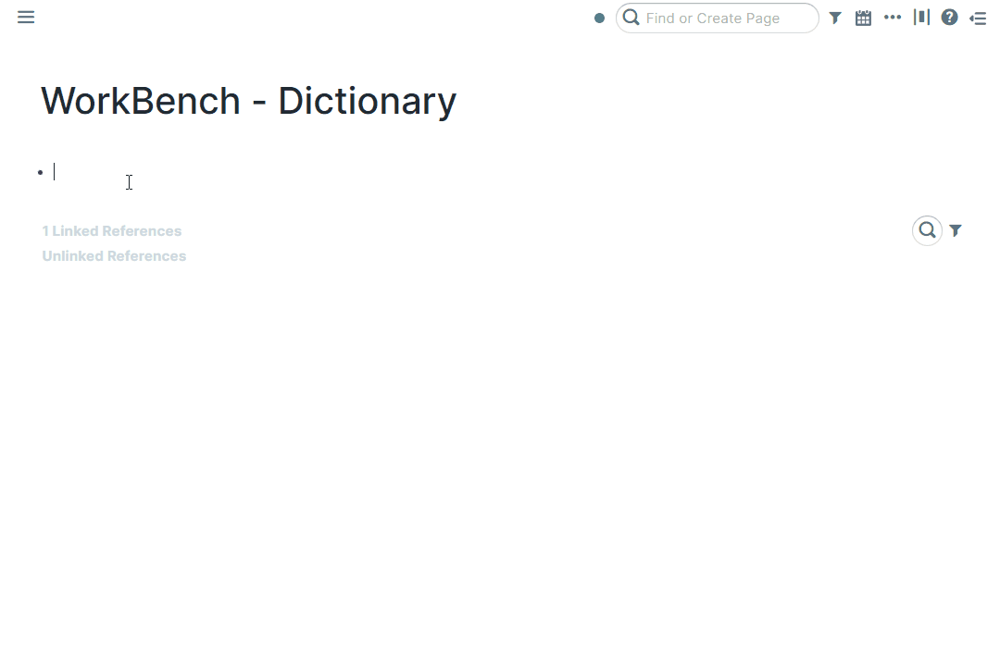
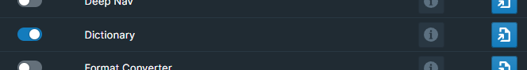

# Overview

A rich dictionary at your fingertips right inside of Roam, based on the rich open-source WordNet dictionary.

# How to Use

Toggle the Dictionary module on inside WorkBench.

To trigger the dictionary, hit `Alt + Shift + .`. This will open a dialog with a typeahead input where you could start searching for the desired word. If you are focused on a block already, the word's definition will be entered into the block! If not, it will appear on a toast on the bottom right corner of the screen.

It's possible to assign a unique hotkey to this command, should you prefer to do so. To accomplish this, navigate to either `Settings` > `Hotkeys` or the WorkBench Extension Settings.

# SmartBlock Format

The best way to format the output is with a [SmartBlock](https://github.com/RoamJS/smartblocks).

Make sure Smartblocks is installed and create a Smartblock with your desired format.

Here is an example:

- `#SmartBlock Dictionary format`
  - This is the word: `<%GET:word%>`
  - The word type is: `<%GET:type%>`
  - The word definition is: `<%GET:definition%>`

Then add the the following block anywhere in your graph with the block reference of the SmartBlock you just created:

`#42Setting Dictionary format ((PKbc4Nd3s))`

# Demo

The following video is outdated, but is the closest available resource to current functionality:

[Video](https://youtu.be/Q2Bn-7l3gVk)
