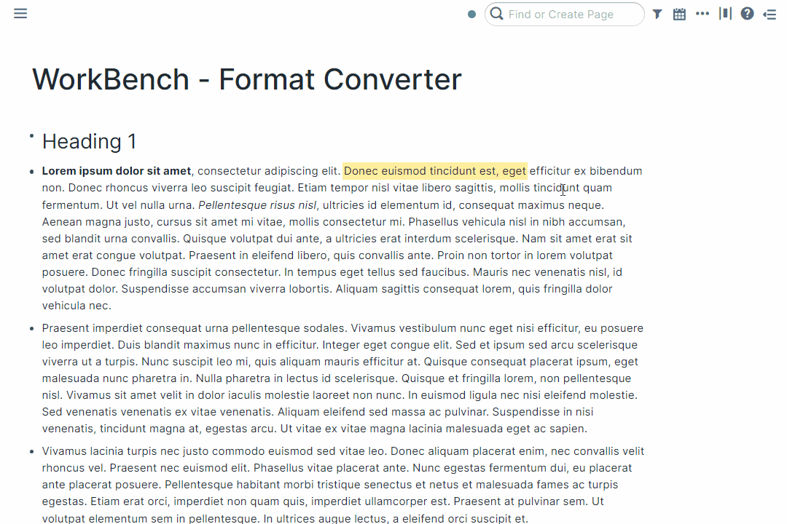

# Overview

The format converter allows users to export their Roam pages into various supported formats.

# How to Use

Toggle the Format Converter module on inside WorkBench.

To open the format converter, use the keyboard shortcut `Alt + m`. This will open a drawer towards the bottom of the page with several options for different output formats for the current Roam page. For each format, you can copy the output to your clipboard, or export it to a `.txt` file.

The format converter also supports a web view. Hit the keyboard shortcut `Alt + Shift + M` to open a dialog that displays what your Roam page would look like on a webpage.

It's possible to assign a unique hotkey to individual commands, should you prefer to do so. To accomplish this, navigate to either `Settings` > `Hotkeys` or the WorkBench Extension Settings.
