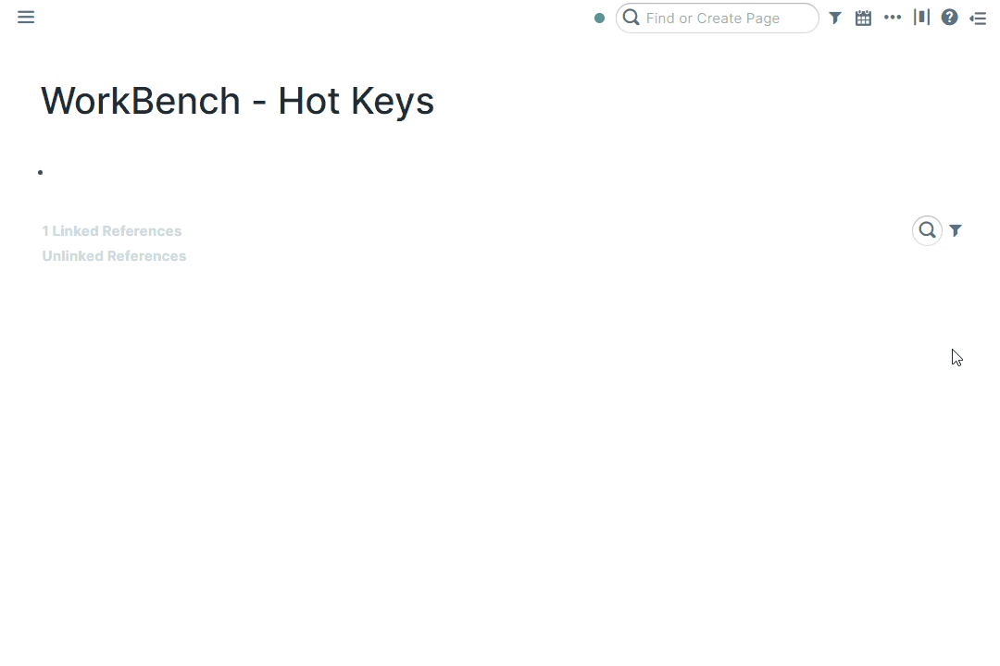
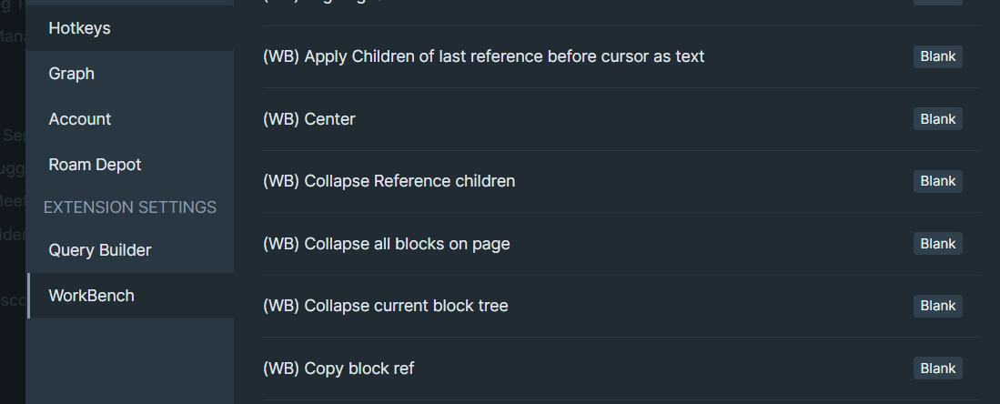

# Overview

Hot Keys provides a set of keyboard shortcuts for interacting with the Roam user interface.

For example: copying the block reference for the current block, expanding and collapsing the page outline and many many more.

# How to Use

Toggle the Hot Keys module on inside WorkBench.

All the hot keys in this module are not set by default.

To set a hotkey, go to `Settings` > `Hotkeys` or click on the WorkBench Extension Settings tab and scroll down.

## Available Hotkeys

### Page

- Jump to the top of the page
- Jump to the bottom of page
- Expand all blocks on page
- Collapse all blocks on page
- Open this page in sidebar
- Add shortcut to page to left sidebar

### Linked/Unlinked References

- Toggle Linked Refs
- Toggle Unlinked Refs
- Toggle Parents (page level)
- Expand children
- Collapse children

### Blocks

- Copy block ref
- Copy block ref as alias
- Expand all
- Collapse all
- Insert block above
- Insert block below
- Go up a block
- Go down a block
- Go to parent block
- Delete block
- Toggle View type
- Replace last reference before cursor with text and alias
- Apply Children of last reference before cursor as text
- Replace last reference before cursor with original + bring nested items along
- Paste block with children as references
- Expand/Collapse block tree to a certain level, specified by the following numeric key press
- Align left
- Center
- Align right
- Justify

### Others

- Toggle Queries
- Toggle left sidebar
- Toggle right sidebar
