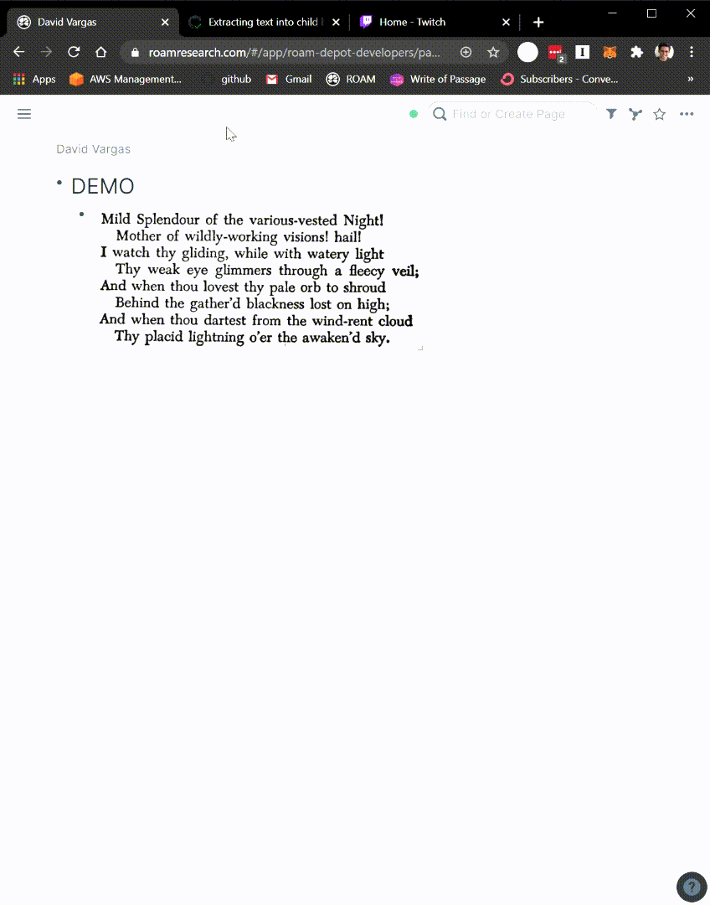

# Overview

This feature extracts the text from an image and add it as child blocks!

# How to Use

Toggle the Image OCR module on inside WorkBench.

Hover over an image in your database.

On hover, a magnifying glass icon with a `T` will appear near the Roam native block edit icon. Clicking the extension will use an OCR library to extract all the text found in an image. In the meantime, it will insert a `Loading...` text as a child block.

Once the extension finishes, it will replace the `Loading...` text with all the new text it parsed from the image. If the text begins with a bullet or dash on a line, the bullet will be stripped, leaving the rest of the text content.

This extension is currently only supported in online mode.

# Demo

