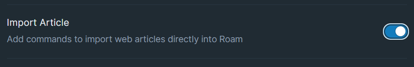

# Overview

Add commands to import web articles directly into Roam

# How to Use

Toggle the Import Article module on inside WorkBench.

In the Roam Command Palette, enter `Import Article into Roam`.

There will be a dialog with a text input where you paste in the article's URL. Then, you could hit the `IMPORT` button and the contents of the article will be imported into your Roam DB!

The extension is making it's best guess on what content from the link is considered the article and what isn't. To help improve the extension over time, send article links that did not quite format correctly to support@roamjs.com.

If there is already an article link in a block, you could use the `ALT+SHIFT+I` or the `OPT+SHIFT+I` keyboard shortcut to automatically import the article from the link. It's possible to assign a unique hotkey to this command, should you prefer to do so. To accomplish this, navigate to either `Settings` > `Hotkeys` or the Workbench Extension Settings.

The overlay supports an "Indent Under Header" option. When checked, this will paste contents as children of each header in the article.

This extension is also integrated with [SmartBlocks](https://github.com/RoamJS/smartblocks)!

If you have both this extension and SmartBlocks installed, there will be a `<%ARTICLE:[link]%>` command available. Replace `[link]` with the desired url that you'd like to import. The command will automatically run the article import logic and paste the contents in the blocks before continuing with the rest of the workflow.
