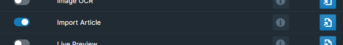

# Overview

Add commands to import web articles directly into Roam

# How to Use

Toggle the Import Article module on inside WorkBench.

In the Roam Command Palette, enter `Import Article into Roam`. You could also use the `ALT+SHIFT+I` or `OPT+SHIFT+I` keyboard shortcut to bring up the import the article dialog.

Input the article's URL where it says `Enter url ...`. Then, hit the `Import Article` button and the contents of the article will be imported into your Roam DB!

## Indent Blocks Under Header

The overlay supports an `Indent Blocks Under Header` option.

When checked, this will paste contents as children blocks of each header in the article.

# Reporting Import Issues

The extension is making it's best guess on what content from the link is considered the article and what isn't. To help improve the extension over time, send article links that did not quite format correctly to support@roamjs.com.

# Hotkey

It's possible to assign a unique hotkey to the command, should you prefer to do so. To accomplish this, navigate to either `Settings` > `Hotkeys` or the WorkBench Extension Settings.

# SmartBlocks Integration

This extension is also integrated with [SmartBlocks](https://github.com/RoamJS/smartblocks)!

If you have both this extension and SmartBlocks installed, there will be a `<%ARTICLE:[link]%>` command available. Replace `[link]` with the desired url that you'd like to import. The command will automatically run the article import logic and paste the contents in the blocks before continuing with the rest of the workflow.

# Demo

https://github.com/RoamJS/workbench/assets/3792666/55c64d63-ddde-4ceb-9e03-1d2b50156344
