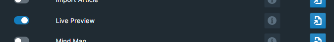

# Overview

Live Preview allows you to hover over a page or block reference and preview editable contents of that page or block, without leaving the page you are on.

This allows you to stay in the context of your work without having to navigate to another page to see its content.

# How to Use

Toggle the Live Preview module on inside WorkBench.

Once the Live Preview feature is enabled, you could hover over any page reference and the live preview should appear near the reference.

You can edit the delay time for when the Live Preview appears. To do so, add the following block text to any block in your graph:

> `#42Setting` LivePreviewDelay 100

The number on the right is in milliseconds, where 100 is the default value used.

You can specify a modifier key so that the live preview only appears when you hold down that modifier key with `LivePreviewModifier`. The following values are supported:

- `shift` - Shift
- `cmd` - Command
- `command` - Command
- `meta` - Command
- `ctrl` - Control
- `control` - Control
- `alt` - Option/Alt
- `opt` - Option/Alt

> `#42Setting` LivePreviewModifier Shift

You can specify the height and width of the Live Preview window using `LivePreviewHeight` and `LivePreviewWidth` respectively. The value could be either numerical, or a pixel value.

> `#42Setting` LivePreviewHeight 200

> `#42Setting` LivePreviewWidth 400px

# Demo

The demo below is for an outdated version of Live Preview, but is the closest resource to what exists today.

[Video](https://youtu.be/o1RadyuMCA8)
