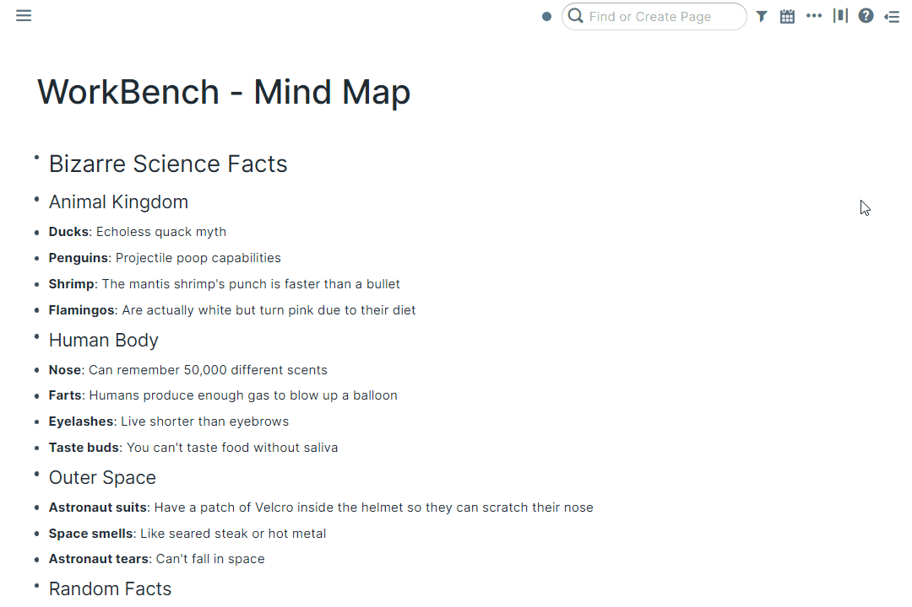
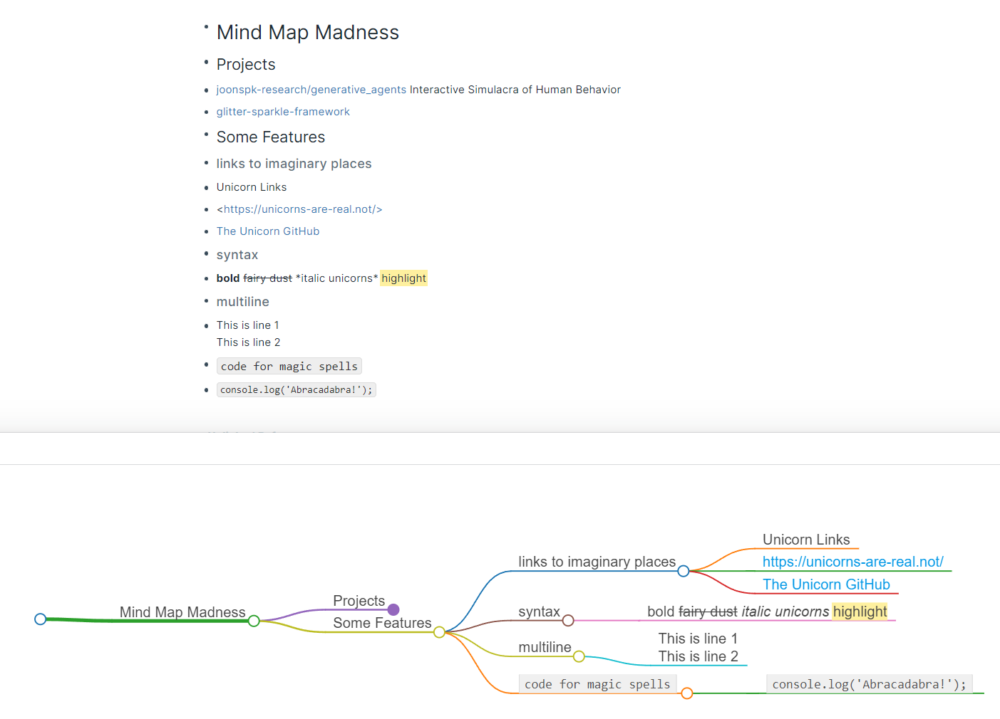
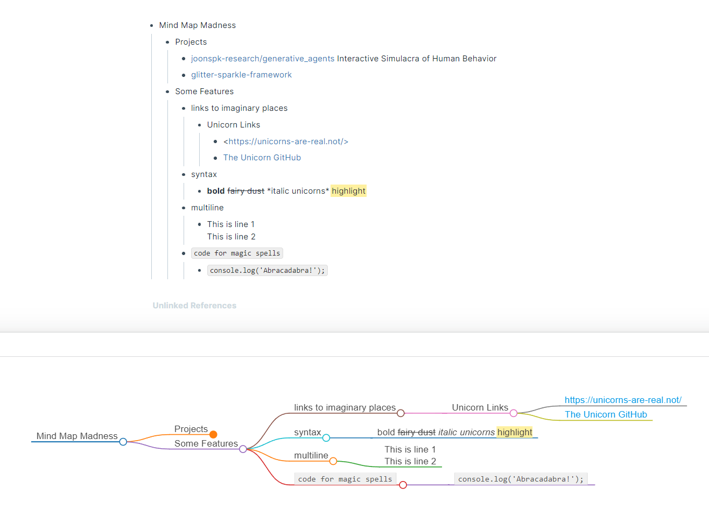

# Overview

Visualize pieces of your Roam graph as a mind map!

# How to Use

Toggle the Mind Map module on inside WorkBench.

Once enabled, there will be a Command Palette command: `(WB) Open Mind Map`

It's possible to assign a unique hotkey to this command, should you prefer to do so. To accomplish this, navigate to either `Settings` > `Hotkeys` or the WorkBench Extension Settings.

Entering the command will open a panel on the bottom of the page rendering your page data as a map diagram.

The panel will have three additional buttons on it:

- **Export**: The leftmost button could be used to export the mind map as a PNG or as a OPML for apps like MindNode.
- **Refresh**: The middle button could be used to refresh the mind map after editing the page data that you're on.
- **Full screen**: The rightmost button could be used to enter and exit full screen.

## Document Structure

You can create nodes via headings, where each heading will be a node:

Or by indenting the children blocks:

## More Info

For more information on markmap, the tool used to create a mind map of your Roam data, visit their [docs](https://markmap.js.org/docs#what-is-markmap)!

# Demo

https://github.com/RoamJS/workbench/assets/3792666/5744c425-263e-4516-9c36-8d0614bc270d
