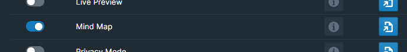
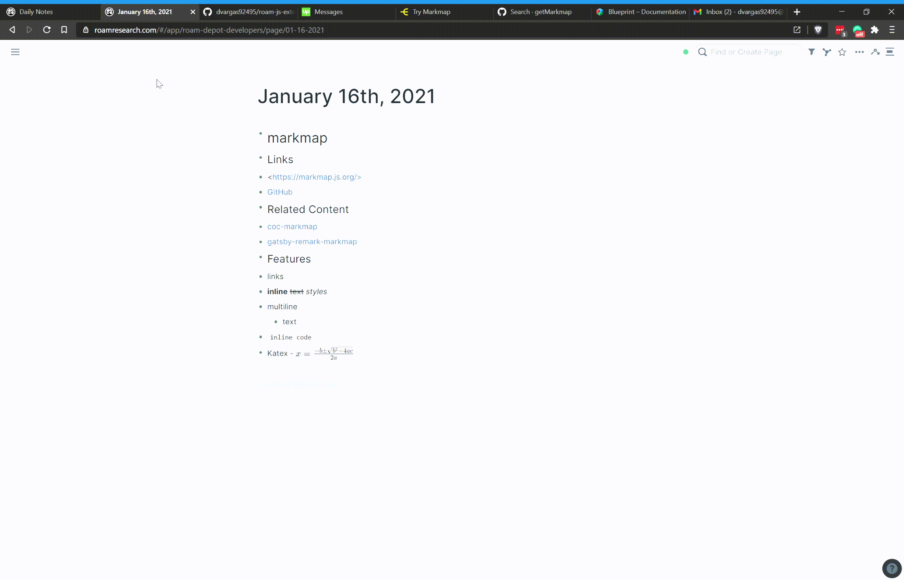

# Overview

Visualize pieces of your Roam graph as a mindmap!

# How to Use

Toggle the Mind Map module on inside WorkBench.

Once enabled, there will be a Command Palette command: `(WB) Open Mindmap`

It's possible to assign a unique hotkey to this command, should you prefer to do so. To accomplish this, navigate to either `Settings` > `Hotkeys` or the Workbench Extension Settings.

Entering the command will open a panel on the bottom of the page rendering your page data as a map diagram.

The panel will have three additional buttons on it. The rightmost button could be used to enter and exit full screen. The middle button could be used to refresh the mindmap after editing the page data that you're on. The leftmost button could be used to export the mindmap as a PNG or as a OPML for apps like MindNode.

Shift clicking any node will bring you to that block's page!

For more information on markmap, the tool used to create a mindmap of your Roam data, visit their [docs](https://markmap.js.org/docs#what-is-markmap)!

# Demo

