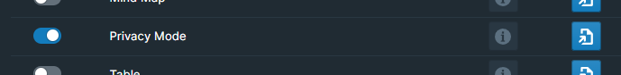

# Overview

Privacy Mode redacts confidential information when showing your Roam database to others. Note: this is not a security feature. It **does not** encrypt or delete data. It is only a visual redaction that you could turn on and off while working in an area with "prying eyes".

# How to Use

Toggle the Privacy Mode module on inside WorkBench.

To toggle on Privacy Mode, use the keyboard shortcut `Opt + Shift + p` on Mac or `Alt + Shift + p` on Windows.

It's possible to assign a unique hotkey to this command, should you prefer to do so. To accomplish this, navigate to either `Settings` > `Hotkeys` or the Workbench Extension Settings.

Create a page called `[[WorkBench Privacy Mode List]]`. This is where you can define the tags that you want to redact while privacy mode is toggled on.

When Privacy mode is toggled on, blocks that reference the tags you have listed on the `[[WorkBench Privacy Mode List]]` will be redacted from your graph.

By default, the full block tree will be redacted. If you would like to redact just the page name, then add an exclamation mark `!` in front of the tag name on the `WorkBench Privacy Mode List` page.

# Demo

The video below is out of date, but is the closest to resource to how this feature works today.

Note that the page title where your privacy list should be defined should be called `[[WorkBench Privacy Mode List]]` instead of `[[Roam42 Privacy Mode List]]`.

[Video](https://www.youtube.com/watch?v=f1UR9dMR_k0&t=524s)
