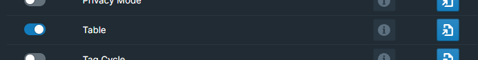

# Overview

Introduce a dynamic table component that can be used in your Roam database. The table provides headers, rows, and various optional styles like striped, bordered, condensed, and interactive. The table content is editable, and changes are reflected in the Roam database.

# How to Use

To integrate the dynamic table component into your application, follow these instructions:

## Enable the Table Module

Toggle the Table module on inside WorkBench.

<!-- TODO -->



## Create the Table

Add `{{wb-table}}` to a roam block. The table component will render inside this button.

## Editable Content

The table's headers and cells are editable. Users can change the content directly in the table, and the changes will be reflected in the Roam database.

## Customize the Table

You can edit individual cells when the table is rendered, but inder the hood, each `{{wb-table}}` has an `options`, `header`, and `rows` child block.

This way you can create custom tables with templates or other automated ways.

### Styling

- table class name: `roamjs-workbench-table`
- headers: `wbt-header-{headerText}`
- rows: `wbt-row-{rowText}`
- cells `wbt-cell-{cellText}`

This allows for tailored styling and flexibility in design.

Note: Currently, the header, row, and cell classes are only set on load / refresh.

### Headers

Headers are created as children of a `header` block.

```
- {{wb-table}}
    -header
        - Header 1
        - Header 2
        - Header 3
```

### Rows

Rows are created as children of a `rows` block.

Each child block of a row will create the cell in that row.

```
- {{wb-table}}
    - rows
        - row1
            - cell1
            - cell2
            - cell3
        - row2
            - cell4
            - cell5
            - cell6
```

### Options

Styles are set as children of a `options` block.

Options include:

- `striped`: Set striped rows.
- `bordered`: Add borders to the table.
- `condensed`: Make the table more compact.
- `interactive`: When you hover or a cell that row changes color.

Example:

```
- {{wb-table}}
    - options
        - striped
        - bordered
```

### Full Example

<details>
<summary> Full Example
</summary>

```
- {{wb-table}}
    -header
        - Header 1
        - Header 2
        - Header 3
    - rows
        - row1
            - cell1
            - cell2
            - cell3
        - row2
            - cell4
            - cell5
            - cell6
    - options
            - striped
            - bordered
```

</details>

<!-- # Demo -->

<!-- TODO -->

<!--  -->
