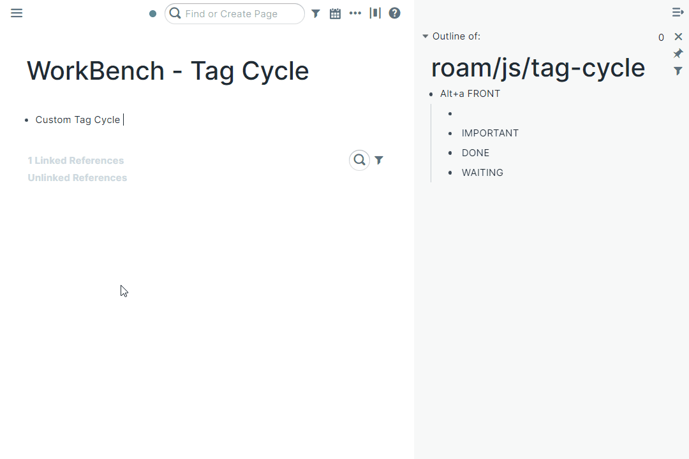
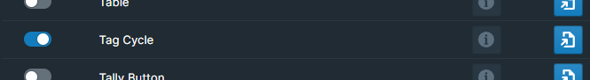
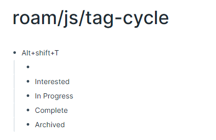
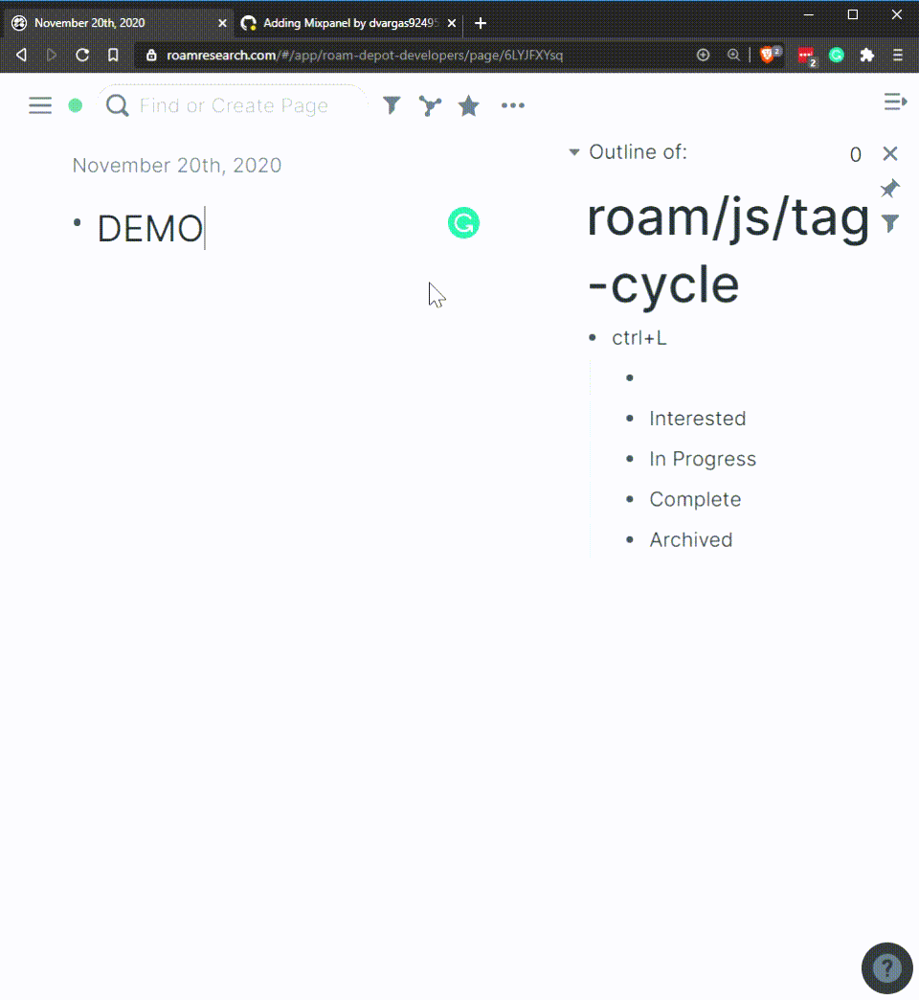

# Overview

Define custom Tag cycles tied to a keyboard shortcut!

# How to Use

Toggle the Tag Cycle module on inside WorkBench.

This extension is configurable via the `roam/js/tag-cycle` page.

For every cycle you want, make a block denoting the keyboard shortcut that will trigger that cycle. Then as children of that block, create one block for each text in the cycle.

Now when you're in a given block, the keyboard shortcut will replace text in your block based on the cycle you defined!

The format of a keyboard shortcut is deliminated by `+`. The following modifiers are supported:

- CTRL
- CMD
- WIN
- ALT

Additionally, could use `SHIFT`, but it should added after the modifier. The Key pressed is the last component.

Here is what I use for my project tracking:

Note that this means entering an empty block will clear the previous element, and append the next element when no other element is found. Blank bullets only append a text to the block when it is a part of only \***\*one\*\*** keystroke.

By default, empty blocks will cycle to a `[[]]` tag. To use a `#[[]]` tag instead, add 'HASH' to the end of the keyboard shortcut like this:

- CTRL+Enter HASH
  - `{leave blank}`
  - TODO
  - DONE

If instead of tags, you would like to cycle through raw text, add RAW to the end of the shortcut. Like this:

- CTRL+Enter RAW
  - `{leave blank}`
  - TODO
  - DONE

By default, empty blocks will cycle the next entry to the end of the block. To prepend to the block instead, add FRONT to the end of the shortcut. Like this:

- CTRL+Enter FRONT
  - `{leave blank}`
  - TODO
  - DONE

Front could combine with some of the other modifiers above. So to fully reproduce Roam's native tag cycle, it would look like this:

- CTRL+Enter FRONT RAW
  - `{leave blank}`
  - {{[[TODO]]}}
  - {{[[DONE]]}}

If you change the blocks on the configuration page, the changes will take effect as soon as you navigate away from the blocks.

# Demo

