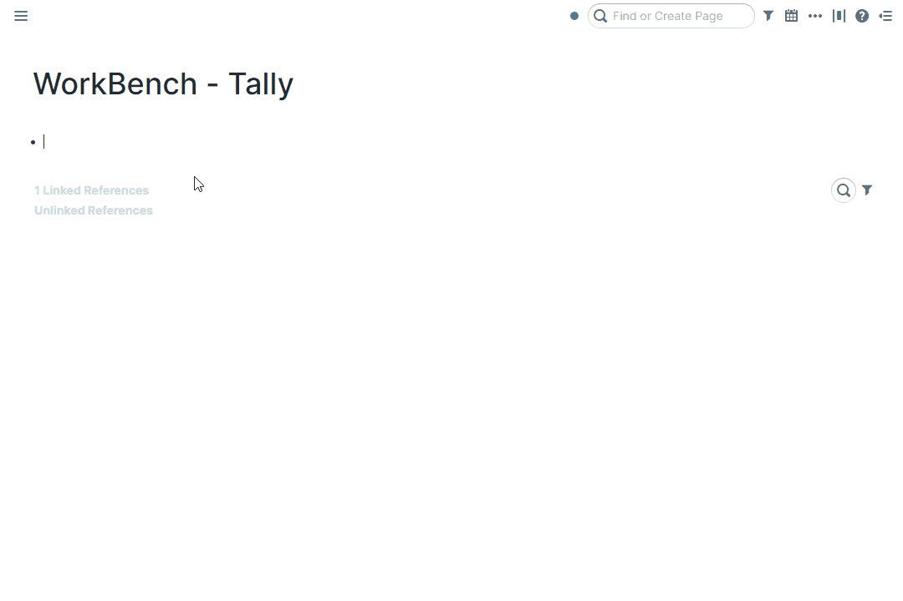
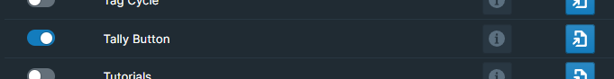
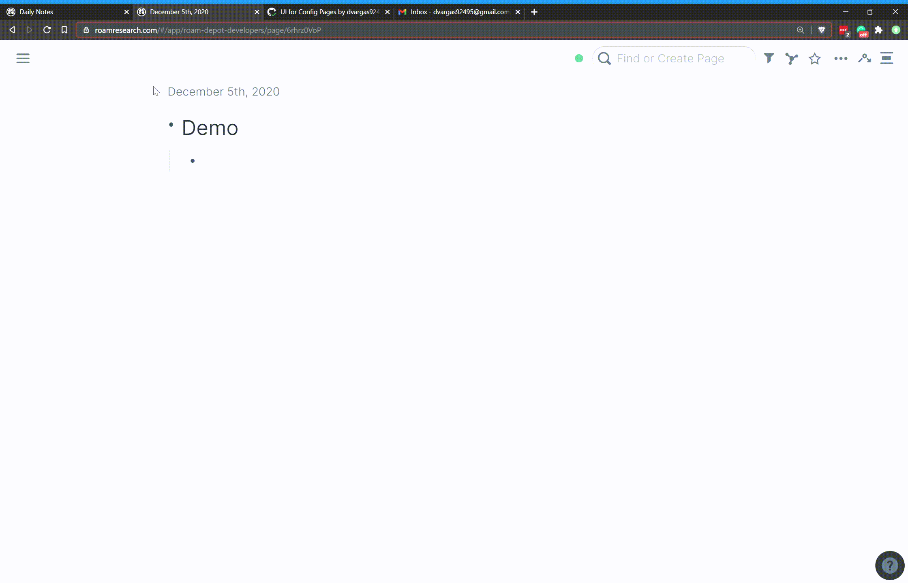

# Overview

Introduce a tally button component to use directly in your Roam database.

# How to Use

Toggle the Tally Button module on inside WorkBench.

Type `{{tally}}` into a block. The component that is rendered will be a tally counter that supports incrementing and decrementing!

Values are automatically saved as a child block of the counter. To set an initial starting value for the counter, create a new or update the existing child block with the specified value.

# Demo

