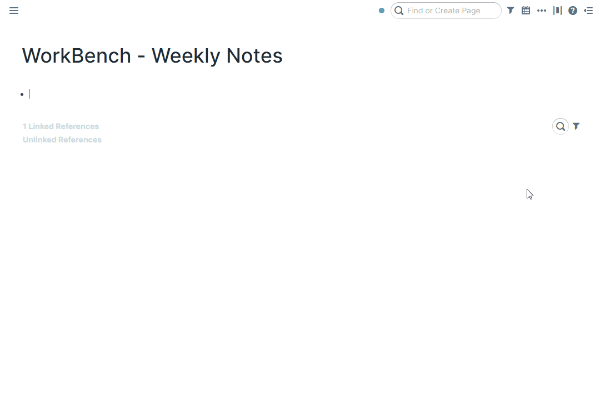
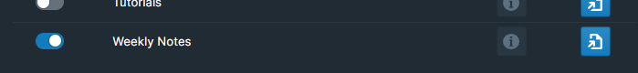

Roam natively supports daily note pages with several utilities that supplement those pages. This extension adds several features to supplement workflows surrounding weekly note pages.



# How to Use

Toggle the Weekly Notes module on inside WorkBench.



# Format

In the `roam/js/weekly-notes` page, you could configure your weekly note page format. In the format, placeholders take the form of `{day:format}`. For example, the default format of

```plain text
{monday:MM/dd yyyy} - {sunday:MM/dd yyyy}
```

would create a page name of:

```plain text
[[04/19 2021 - 04/25 2021]]
```

For format, check out [this page](https://date-fns.org/v2.21.1/docs/format) for the syntax on what each symbol means.

## ISO Week Format

Weekly Notes supports ISO week-numbering formats. Use the following tokens for ISO week-based naming:

| Token | Description | Example |
|-------|-------------|---------|
| `I` | ISO week number (1-53) | `1`, `52` |
| `II` | ISO week number, 2 digits | `01`, `52` |
| `R` | ISO week-numbering year | `2024` |
| `RRRR` | ISO week-numbering year, 4 digits | `2024` |

**Examples:**

```plain text
{monday:RRRR}-W{monday:II}
```
would create: `[[2024-W52]]`

```plain text
Week {monday:I} {monday:RRRR}
```
would create: `[[Week 52 2024]]`

**Note:** ISO weeks always start on Monday. ISO week 1 is the week containing the first Thursday of the year, so dates in late December may belong to week 1 of the following year. Use `R`/`RRRR` (ISO week-numbering year) instead of `yyyy` (calendar year) when using ISO week numbers to ensure consistency.

# Auto Tagging

When a new weekly page is created, the weekly page will be tagged in all of the daily pages that are part of the week. The tag will be added as the top block on the page. This could be toggled on and off in the `roam/js/weekly-notes` page.

# Auto Embedding

When a new weekly page is created, the weekly page will embed all of the related daily pages from the week, in order. This could be toggled on and off in the `roam/js/weekly-notes` page.

# Keyboard Shortcut

Roam's Daily Note Page log is reachable with the `ALT+d` keyboard shortcut. To jump to this week's page, hit `Alt+w` or `Ctrl+Shift+W` (Mac Only).

It's possible to assign a unique hotkey to individual commands, should you prefer to do so. To accomplish this, navigate to either `Settings` > `Hotkeys` or the WorkBench Extension Settings.

# Next/Previous Week

Each weekly note page will come with a previous and next week button below the header. Clicking each of those buttons will jump you to the previous or next week page respectively.

# Immutable Titles

Just like Daily Notes, this extension prevents users from changing the title of weekly note pages.

# Auto Load

On the `roam/js/weekly-note` page, there is a flag for automatically jumping to the weekly note page when you load the daily note log on Roam's first load.
